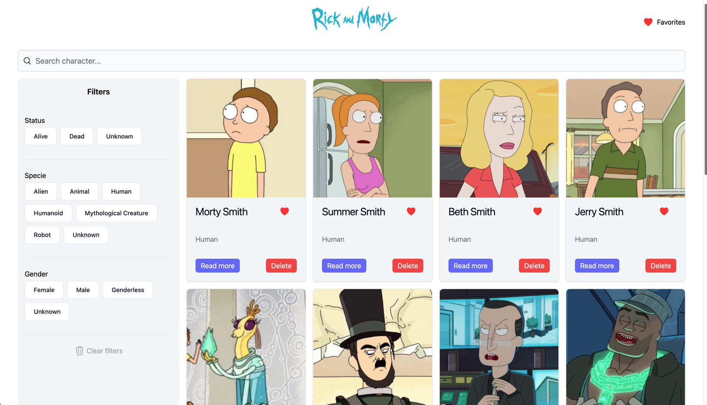
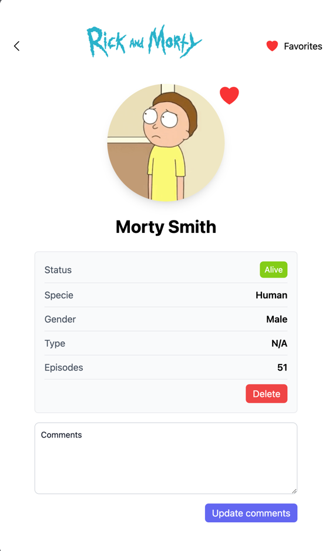

# Rick And Morty Web

created by: Nikollai Hernandez.\
[nikollaihernandez@gmail.com](mailto:nikollaihernandez@gmail.com)

## Available Scripts

In the project directory, you can run:

### `npm start`

Runs the app in the development mode.\
Open [http://localhost:3000](http://localhost:3000) to view it in your browser.

The page will reload when you make changes.\
You may also see any lint errors in the console.

### `npm test`

Launches the test runner in the interactive watch mode.\
See the section about [running tests](https://facebook.github.io/create-react-app/docs/running-tests) for more information.

### `npm run build`

Builds the app for production to the `build` folder.\
It correctly bundles React in production mode and optimizes the build for the best performance.

The build is minified and the filenames include the hashes.\
Your app is ready to be deployed!

See the section about [deployment](https://facebook.github.io/create-react-app/docs/deployment) for more information.

### `npm run eject`

**Note: this is a one-way operation. Once you `eject`, you can't go back!**

If you aren't satisfied with the build tool and configuration choices, you can `eject` at any time. This command will remove the single build dependency from your project.

Instead, it will copy all the configuration files and the transitive dependencies (webpack, Babel, ESLint, etc) right into your project so you have full control over them. All of the commands except `eject` will still work, but they will point to the copied scripts so you can tweak them. At this point you're on your own.

You don't have to ever use `eject`. The curated feature set is suitable for small and middle deployments, and you shouldn't feel obligated to use this feature. However we understand that this tool wouldn't be useful if you couldn't customize it when you are ready for it.

## GraphQl Queries

### Characters

    query Characters($page: Int, $query: String, $status: String, $gender: String, $specie: String) {
        characters(page: $page, filter: { name: $query, status: $status, gender: $gender, species: $specie }) {
            results {
                id
                name
                image
                species
            }
            info {
                count
                pages
                next
                prev
            }
        }
    }

#### Parameters

**`$page`**: (Int, optional): The page number to retrieve in the paginated result.\
**`$query`**: (String, optional): Filter by character name.\
**`$status`**: (String, optional): Filter by character status (e.g., "Alive", "Dead", "Unknown").\
**`$gender`**: (String, optional): Filter by character gender (e.g., "Male", "Female", "Unknown").\
**`$species`**: (String, optional): Filter by character species (e.g., "Human", "Alien", "Robot", "Animal").

#### Response

##### `results` {

**`id`**: (ID): Unique identifier of the character.\
**`name`**: (String): Name of the character.\
**`image`**: (String): URL of the character's image.\
**`species`**: (String): Species of the character.

}

##### `info` { 
**`count`**: (Int): Total number of characters available.\
**`pages`**: (Int): Total number of pages.\
**`next`**: (Int or null): Page number of the next set of results, or null if no more pages.\
**`prev`**: (Int or null): Page number of the previous set of results, or null if no previous pages.\

}

### Character details

    query GetCharacter($id: ID!) {
        character(id: $id) {
            id
            name
            image
            species
            status
            gender
            type
            episode {
                id
            }
        }
    }

#### Parameters

**`$id`**: (ID!): The unique identifier of the character. This parameter is required (! indicates it is non-nullable).

#### Response

**`id`**: (ID): The unique identifier of the character.\
**`name`**: (String): The name of the character.\
**`image`**: (String): The URL of the character's image.\
**`species`**: (String): The species of the character (e.g., "Human", "Alien").\
**`status`**: (String): The status of the character (e.g., "Alive", "Dead").\
**`gender`**: (String): The gender of the character (e.g., "Male", "Female").\
**`type`**: (String): The type of the character, if applicable.\
**`episode`**: An array of episodes the character has appeared in. Each episode object contains:\
-----**`id`**: (ID): The unique identifier of the episode.\

## Screenshots

